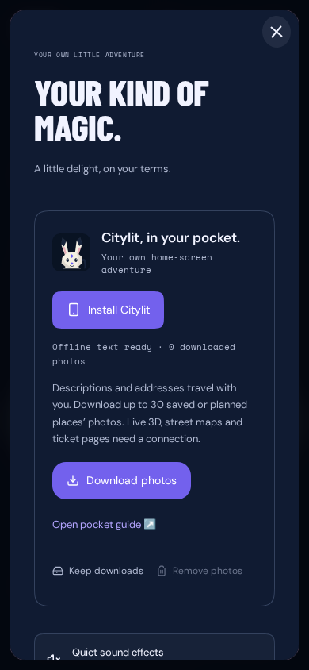
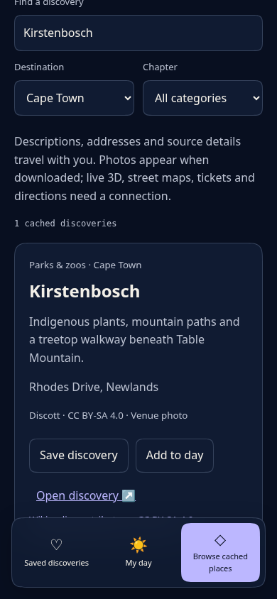

# Citylit PWA and native interactions

Citylit can be installed as a home-screen app. Settings and Passport contain install, offline, update and storage controls. Browser support determines which controls are available; no account or paid PWA package is needed.

## Installation and sharing

- Chrome/Edge offer an install prompt only after pressing **Install Citylit**, when the browser reports eligibility. Otherwise the panel explains the browser menu. Safari on iPhone/iPad uses **Share → Add to Home Screen → Add**. Installation is never prompted automatically.
- Installed launches use standalone mode, an app identity, maskable and Apple icons, and the current theme’s browser chrome. The manifest provides shortcuts to Discover, My day, Passport and the pocket guide, plus narrow and wide install screenshots.
- On platforms supporting Web Share Target, share a Citylit place, or a known catalog venue/Wikipedia URL, into Citylit. The app resolves it locally and offers to save or open the place. Unknown links are not fetched or rendered. Shared GET parameters can appear in normal hosting request logs.
- Outgoing share dialogs still use the native Web Share API with clipboard fallback. Cancelling a share is quiet.

## Offline guide

The first successful production visit installs the worker and caches public descriptions, addresses, sources, practical facts, icons and the standalone pocket-guide reader. **Download photos** caches one photo for each of up to 30 saved/planned place IDs per request; shared images occupy one cache entry. Photos are not automatically downloaded during browsing.

Cold launches to known cities, categories and places retain their catalog context offline. The reader supports search, destination/category filters, detail history, saves, visits and day-plan editing. Changes use the same validated browser-local state as the connected app. No account synchronization is implied. Some platforms give an installed app a separate storage profile from its browser tab; share a day link to transfer its public stops when needed. Online/offline notices describe the connection without blocking the interface.

Live 3D scenes, street maps, ticket pages and external directions require a connection. Street-map tiles, arbitrary remote URLs, Next.js RSC responses, health endpoints and nonce-bearing application HTML are never cached. Offline launch uses `/offline.html`, `/offline.css` and `/offline.js`, avoiding stale nonce HTML. The worker preserves real 404/auth responses; failed, timed-out (seven seconds) or 5xx navigations fall back to the guide.

**Remove photos** clears downloaded photographs while preserving text and local saves/plans. **Keep downloads** explicitly requests browser storage persistence; the UI reports whether the browser grants it. Storage can still be cleared by the user or OS. Connect once and reopen the app to recreate downloads if necessary. Field-guide download messages have bounded response timeouts and explain partial failures.

## Updates and deployment

`pnpm build` runs `scripts/build-pwa.mjs` before Next.js. It writes a gitignored `/pwa-release.js`, whose hash includes the deployment commit, reader/data/manifest and app icons. Do not deploy a hand-run `next build` without that generation step. Development does not register the worker, avoiding stale development assets.

The imported release script and worker are served with `no-cache, no-store` and registration uses `updateViaCache: "none"`. Every Vercel/GitHub commit changes the offline cache identity. Local builds change identity when the listed inputs change. No extra runtime dependency is required.

First installation activates normally. Later versions wait; **Update Citylit** explicitly activates and reloads the requesting tab. Other open tabs receive a reload notice and keep their screen until they choose to reload. Saved places/plans remain in local storage. New offline-management commands wait until that update is applied, so an older controlling worker cannot download a reader without its new dependencies. Checks on visibility resume are throttled to once per hour; failed updates show a retry message rather than forcing a reload.

Activation copies downloaded photos from older Citylit caches before removing them. If quota prevents a complete copy, the old cache is retained as a photo fallback. Offline guide assets have a separate lifecycle from personal browser-local state.

## Native feel and accessibility

Safe-area padding protects controls from notches and home indicators. Viewports resize for the keyboard, inputs remain at 16px, and page zoom/text selection remain available. Scroll containers avoid scroll chaining. Settings and photo galleries use native modal dialogs with focus restoration, Escape/dismiss controls and supported platform close requests. Gallery photos support pinch/pan, horizontal navigation and downward dismissal when unzoomed. Glass navigation, squircle fallbacks, reduced-motion options, opt-in sound and optional haptics are retained. Continuous animations pause while hidden.

Automated Chromium tests cover mobile and desktop install-event behavior, iPhone instruction detection, update consent, offline cold starts, route changes, download/removal, shared links, browser-local state, both themes, keyboard focus and WCAG checks. Real OS installation, task-switcher appearance, safe-area cutouts, Android back gestures and VoiceOver/TalkBack still need a physical-device acceptance pass. Browser emulation does not prove those platform integrations.

Push notifications and background delivery are not configured. They require consent, subscription storage and an authenticated delivery service; the app does not install an insecure demonstration push endpoint. Badging, background sync and automatic caching of third-party maps are not claimed.

## Review screenshots

