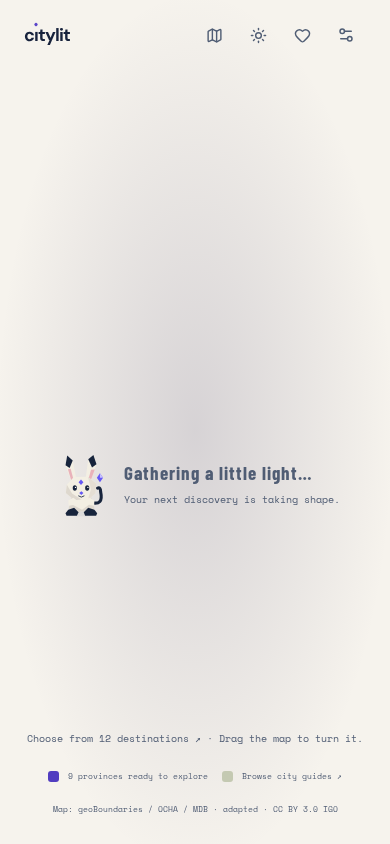
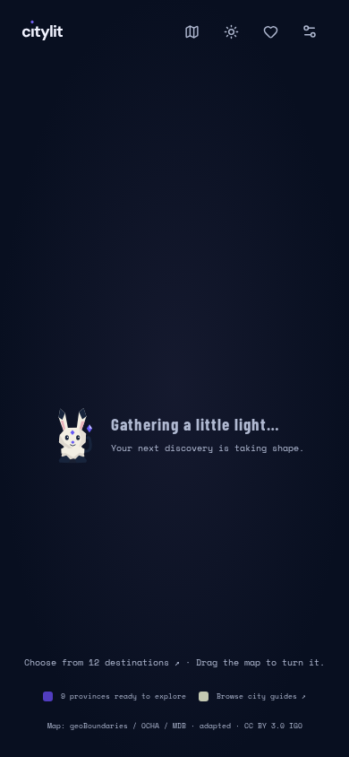
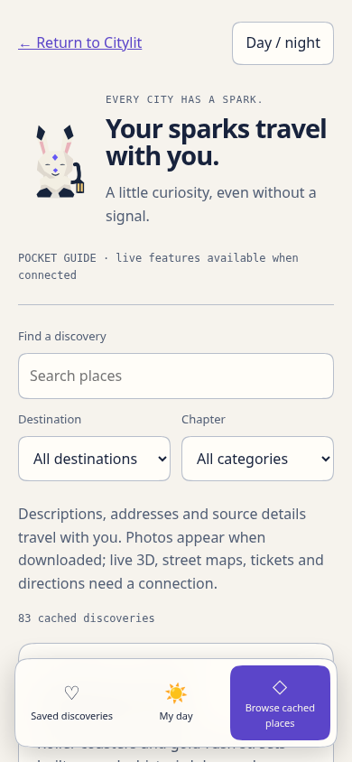

# Seamless page and browser backgrounds

Citylit uses one opaque page color: daylight `#f6f3ed` or night garden `#080f20`. `/theme.css` supplies the same semantic tokens to the live application, route loading UI, recovery document and downloaded guide. Cards keep their surface colors; the shared Three.js canvas stays transparent so each city's restrained glow remains visible.

The small, first-party `/theme.js` script runs in the document head before content paints. Its app script tag carries the request's CSP nonce; the static offline document permits only same-origin scripts. A validated `citylit-theme` choice wins over the device preference. Without a saved choice, OS changes apply live; manual choices remain in memory when storage is denied. Storage events synchronize other tabs. React controls subscribe to the resolved document theme rather than writing their initial server-rendered night value back to the page.

If the root layout fails before that script runs, the standalone recovery document includes a small fixed bootstrap whose exact bytes are authorized by a SHA-256 CSP hash. It resolves the saved theme before paint and loads the same first-party runtime through `strict-dynamic`. No request/user text is interpolated; arbitrary inline scripts, event handlers and production eval remain blocked. The error component is rendered separately in browser tests under an actual response policy with `/theme.js` delayed.

Media-qualified `theme-color` metadata and CSS provide device-aware defaults even without JavaScript. The bootstrap keeps browser metadata aligned with the chosen theme after navigation. Root and atmosphere backgrounds change together immediately; existing city glows and object interactions supply the animation. Safe-area padding, viewport-fit coverage, dynamic viewport heights and `100vh` fallbacks keep the edges painted in portrait, landscape and installed mode.

The offline worker caches both shared theme assets and includes them in the build's release hash. Nonce HTML and RSC remain network-only. The explore route has an accessible, themed loading state; a global streaming loading boundary is intentionally avoided so invalid public routes retain their HTTP 404 status.

## Verification

`pnpm build && CI=1 pnpm test tests/theme.spec.ts` exercises delayed React bundles, opposite saved/device preferences, JavaScript-free shells, denied or malformed storage, OS and cross-tab changes, route metadata replacement, compact portrait/landscape and cold offline launches. CI runs these checks in mobile/desktop Chromium, iPhone-sized WebKit and desktop Firefox. The broader suite retains CSP, HTTP status, accessibility, gestures and discovery checks.

The cold-launch check serves an allowlisted snapshot of the app's public reader/worker responses on an isolated local origin, registers the real worker and stops that origin after its assets download. It then opens a place URL and reloads the guide. This verifies cached recovery on all three engines without relying on WebKit's [broken offline emulation](https://github.com/microsoft/playwright/issues/42775). Opening the province picker also verifies that map labels cannot intercept its links.

## Platform limits

Browsers decide whether and how to apply `theme-color`; desktop chrome cannot always be tinted. iOS installed status bars use the existing translucent setting so the page background extends behind them. An OS-owned launch splash can use the install-time manifest's night color before the document runs; a user's later theme change cannot reliably recolor that cached splash on every platform. Real-device installation testing remains useful alongside browser-engine emulation.

Design guidance: [web.dev — Theming](https://web.dev/learn/design/theming).

## Browser captures

These phone captures hold the Next.js bundles to show the real first paint with a saved theme opposite to the device preference. The offline capture shows the same daylight background in the downloaded reader.

